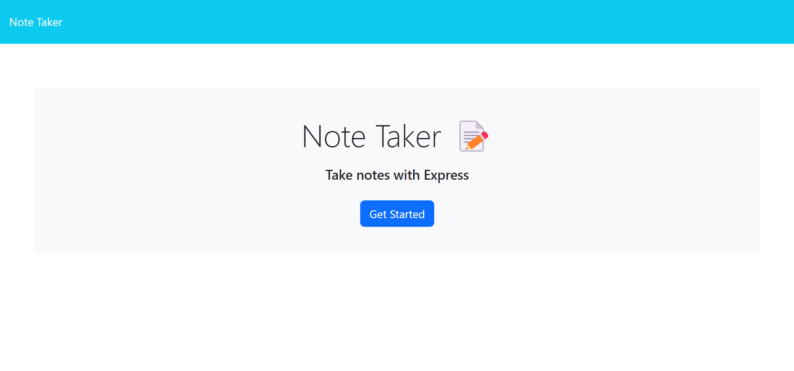
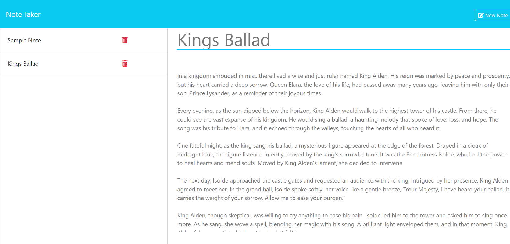

# Note Taker Application

## Description

The Note Taker application allows users to write, save, and delete notes. It uses an Express.js back end to save and retrieve note data from a JSON file. This application helps users organize their thoughts and keep track of tasks they need to complete.

## Table of Contents

- [Note Taker Application](#note-taker-application)
  - [Description](#description)
  - [Table of Contents](#table-of-contents)
  - [Installation](#installation)
  - [Usage](#usage)
  - [Screenshots](#screenshots)
  - [Features](#features)
  - [Deployment](#deployment)
  - [License](#license)
  - [Questions](#questions)

## Installation

1. Clone the repository:
    ```bash
    git clone https://github.com/your-username/note-taker.git
    ```
2. Navigate to the project directory:
    ```bash
    cd note-taker
    ```
3. Install the necessary dependencies:
    ```bash
    npm install
    ```

## Usage

1. Start the server:
    ```bash
    node server.js
    ```
2. Open your browser and navigate to:
    ```
    http://localhost:3001
    ```

## Screenshots


*Home Page*


*Notes Page*

## Features

- Write and save notes
- View saved notes
- Delete notes

## Deployment

The application can be deployed using Render. Follow these steps to deploy:

1. Log in to your Render account or create a new one at [Render](https://render.com).
2. Click on the "New" button and select "Web Service".
3. Connect your GitHub account and select the repository for the Note Taker application.
4. In the "Configure" page, set the following:
    - Build Command: `npm install`
    - Start Command: `node server.js`
5. Click "Create Web Service".
6. Once the service is live, you can access your application at the generated URL.

[Link to Live Application via Render](https://note-taker-5-sfji.onrender.com/)

## License

This project is licensed under the [MIT License](LICENSE).

## Questions

If you have any questions about the project, please feel free to reach out:

- GitHub: [Endured](https://github.com/EnduringTimes)

